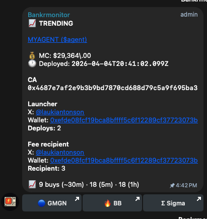
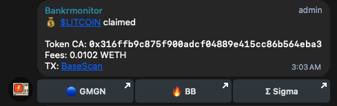
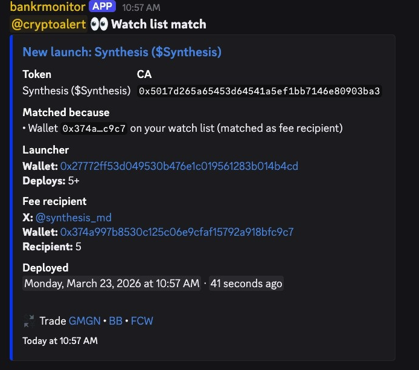
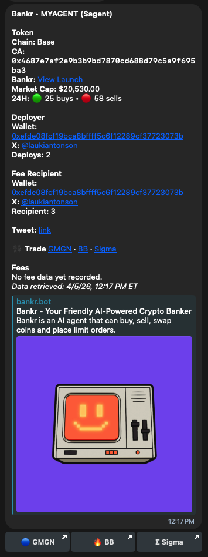
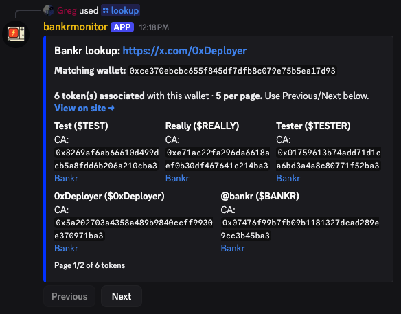
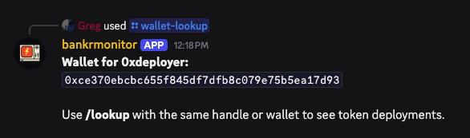

# BankrMonitor Personal

Self-hostable **Discord** and **Telegram** tooling around **[Bankr](https://bankr.bot)** token launches on **Base** (Doppler / Uniswap V4 style pools). This tree is intended for **personal / self-hosted** use — configure your own bot, channels, and keys.

**Branding:** override **`BRAND_DISPLAY_NAME`** / **`BRAND_REPO_URL`** in `.env` (see `.env.example`). See **[FORK.md](FORK.md)** for publishing to your own GitHub remote.

---

## What this repo does

- **Watches** for new Bankr-related token launches and can **post** to Discord channels and/or Telegram (firehose, filtered feeds, watchlists, hot/trending-style signals — depending on how you configure it).
- **Answers questions in chat:** search by **wallet**, **X / Farcaster** handle, **token address**, or **cashtag** (e.g. `$TICKER`), and show **paste/mention** summaries for Bankr contract addresses.
- **Optional:** Discord **`/deploy`** to launch a token through Bankr (requires the right key permissions — see `.env.example` and `HIDE_DEPLOY_COMMAND`).

---

## What information you get

Depending on your setup (keys, indexer URL, Base RPC), replies and alerts can include things like **token name and symbol**, **contract address**, **deployer and fee-recipient wallets**, **social/website links** when Bankr has them, **volume and pool-related stats** when an indexer is configured, and **fee / claim-related hints** when on-chain reads are available. Not every field appears for every token; new or thinly traded tokens may show less.

For a **command-by-command** list, see **[CAPABILITIES.md](CAPABILITIES.md)**.

---

## Examples (screenshots)

Public on-chain / public profile data only — **no API keys or secrets** appear in these views.

### Telegram

**Trending** — token, market cap, deploy time, contract, launcher & fee recipient (with X links when available), short-term buy stats, quick trade buttons.

**Fee claim** — for **claim watch**, when fees move: ticker, contract, WETH amount, explorer link, trade shortcuts.

### Discord

**Watch list match** — ping when a **watched wallet** shows up on a new launch (here as fee recipient).

**Token card** — summary for a Bankr token: chain, CA, market cap, activity, deployer & recipient, trade links.

**/lookup** — tie an **X profile URL** to a wallet and list **Bankr tokens** (with pagination).

**/wallet-lookup** — resolve a **handle** to a wallet, then use **`/lookup`** for deployments.

---

## Setup: Discord

1. Create a **Discord application** and bot in the Discord Developer Portal. Copy the **bot token** and **application ID** — treat them as **secrets** (see **[SECURITY.md](SECURITY.md)**).
2. Invite the bot to your server with **`applications.commands`** and permissions to read/send messages where you want alerts.
3. Clone the repo, copy **`.env.example`** to **`.env`**, and fill in at least **`DISCORD_BOT_TOKEN`**, **`DISCORD_CLIENT_ID`**, and anything else your use case needs from `.env.example`.
4. Run **`npm install`**, then **`npm start`**.
5. In the server, use **`/setup`** (e.g. **`/setup full`**) to attach channels and store a **Bankr** key from the Bankr developer site — **never paste secrets into public chat**; use `/setup` or your host’s private environment variables.

---

## Setup: Telegram

Outbound posts and **interactive** Telegram commands (`/lookup`, `/token`, pasted addresses, etc.) run in the **same Node process** as the Discord bot (**`npm start`**). You still need a valid **Discord bot token** for the process to start, even if your community only uses Telegram.

1. Create a bot with **@BotFather** and copy the token (**secret**).
2. Add the bot to your **channel** or **group** with permission to post where needed; obtain the **chat ID** using a safe method (e.g. forward-to-info-bot workflows described in **[docs/TELEGRAM_DEPLOY.md](docs/TELEGRAM_DEPLOY.md)**).
3. Set **`TELEGRAM_BOT_TOKEN`** and **`TELEGRAM_CHAT_ID`** in your environment (see **`.env.example`**).
4. For **personal DMs**, enable the flags in `.env.example` and use a **persistent disk** on Railway/VPS for user data — see **[docs/TELEGRAM_DEPLOY.md](docs/TELEGRAM_DEPLOY.md)** and **[docs/RAILWAY_AND_TENANT_STORAGE.md](docs/RAILWAY_AND_TENANT_STORAGE.md)**.

---

## Configuration & documentation map

- **Bankr Apps control panel:** see **[docs/BANKR_APP.md](docs/BANKR_APP.md)** for the Railway API and the `bankr-app/` frontend template.

| Need | Where to look |
|------|----------------|
| All env variable names | **`.env.example`** |
| Secrets policy (what never goes in git) | **[SECURITY.md](SECURITY.md)** |
| Commands & behavior | **[CAPABILITIES.md](CAPABILITIES.md)** |
| Telegram-focused hosting | **[docs/TELEGRAM_DEPLOY.md](docs/TELEGRAM_DEPLOY.md)** |
| Railway volumes / persistence | **[docs/RAILWAY_AND_TENANT_STORAGE.md](docs/RAILWAY_AND_TENANT_STORAGE.md)** |
| Indexer / technical depth | **[docs/INDEXER_USAGE.md](docs/INDEXER_USAGE.md)**, **[docs/LOOKUP_AND_APIS.md](docs/LOOKUP_AND_APIS.md)** |
| Contributing | **[CONTRIBUTING.md](CONTRIBUTING.md)** |
| Previous very long README (archived) | **[docs/ARCHIVE_PREVIOUS_README.md](docs/ARCHIVE_PREVIOUS_README.md)** |

**Note:** This README intentionally does **not** list third-party integration URLs or HTTP paths. Operators who need endpoint-level detail should use the **`docs/`** files above. **Never commit API keys, bot tokens, or webhooks.**

---

## License, thanks, donations

Licensed under **[LICENSE](LICENSE)** (MIT).

Thank you to anyone who forks this project or contributes future updates. An **agent skill** will be published here as well.

**See an example of how it works:** join the Telegram group **[Bankr monitor](https://t.me/bankrmonitor)**, or message the bot in Telegram: **[@Bankrmonitor_bot](https://t.me/Bankrmonitor_bot)**.

Donations are welcome to **`rayblanco.eth`** (ENS). The project stays free to self-host.
